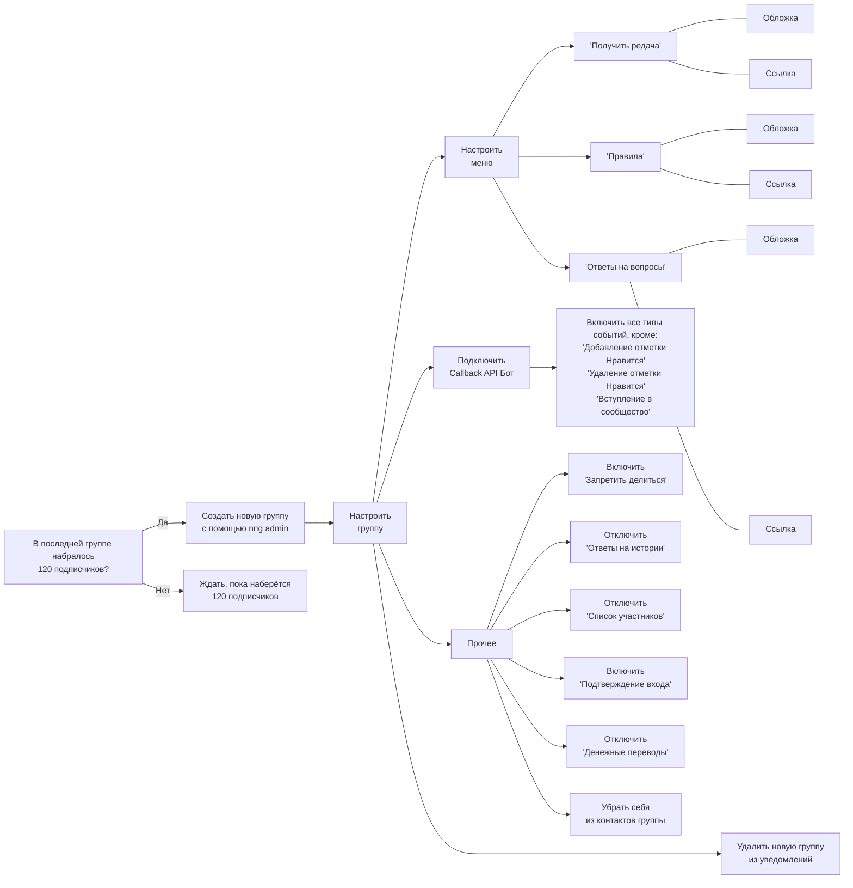
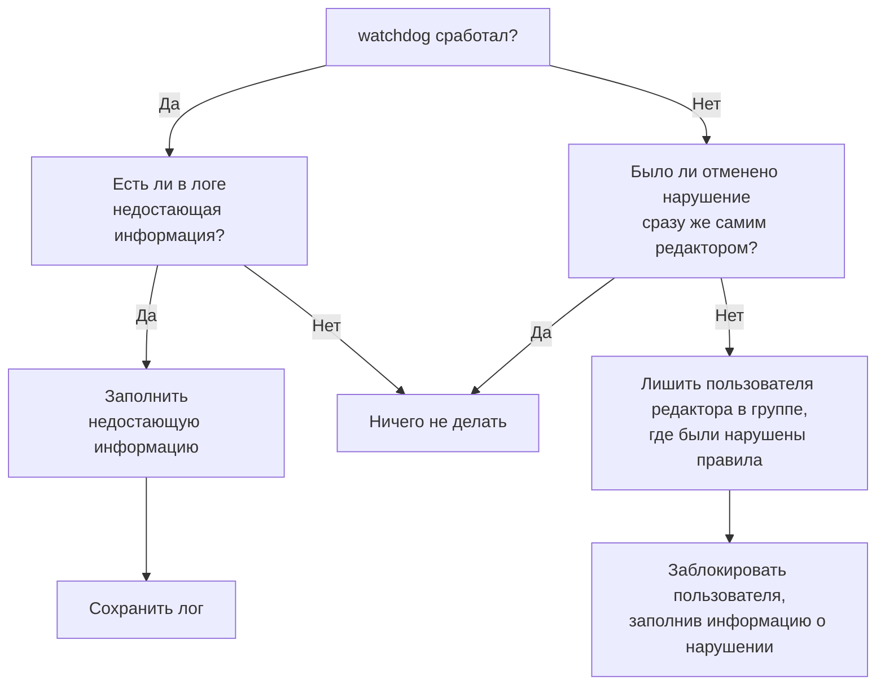
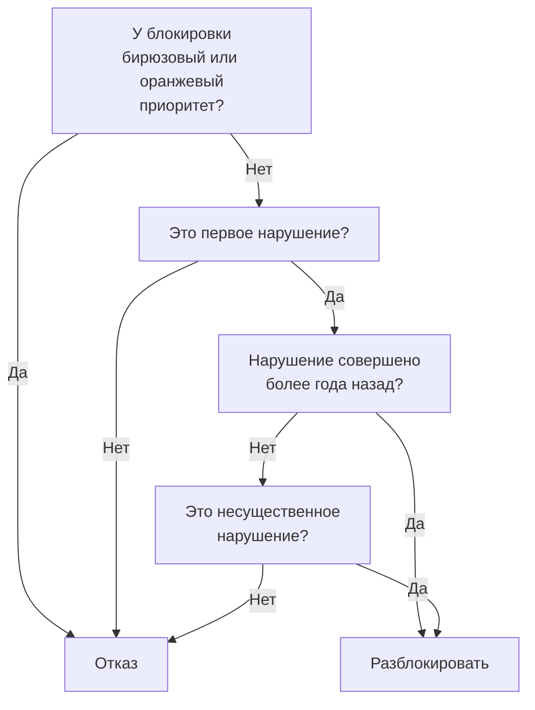
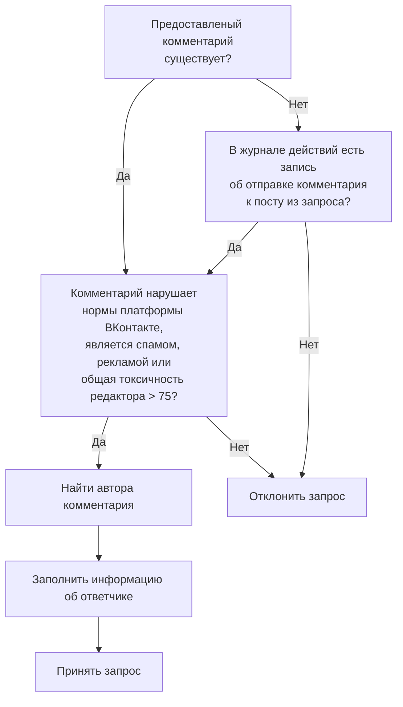
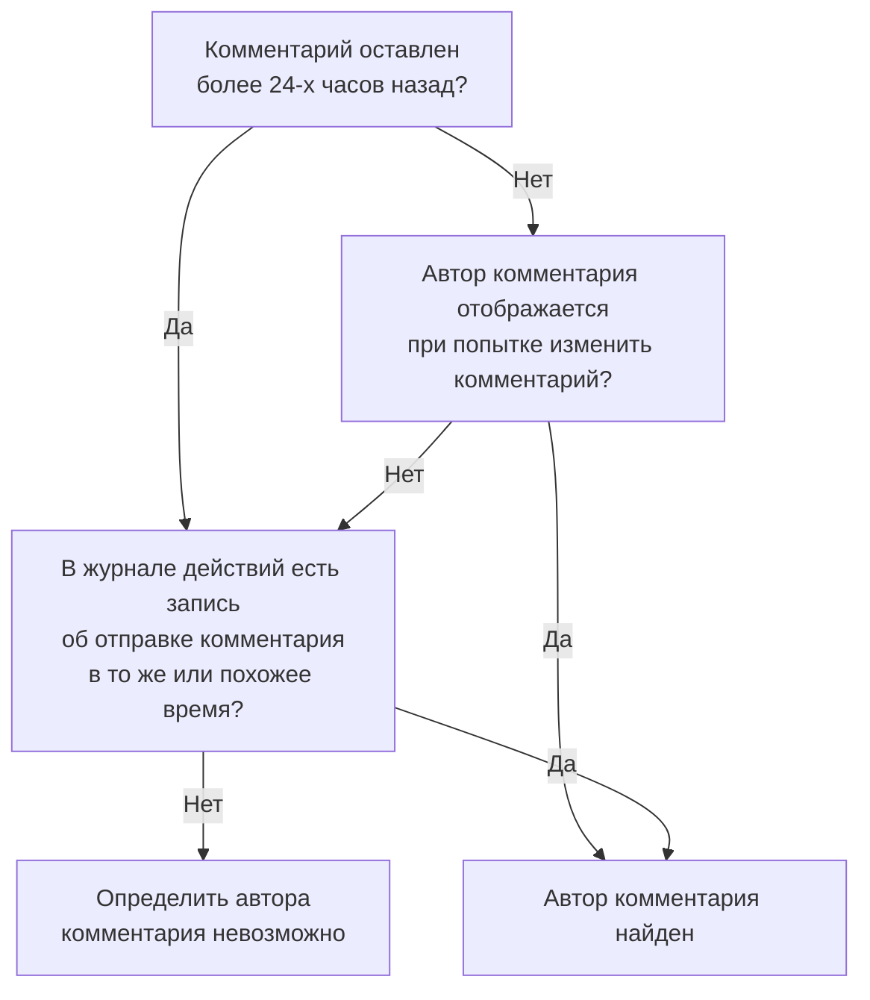
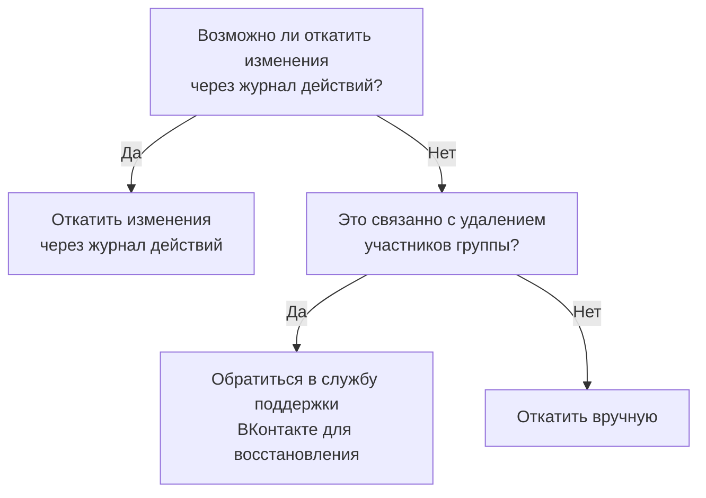

# 🔧 Процессы

Все процессы лень запоминать, поэтому мы их записываем.

## Создание новой группы

## Блокировка

## Разблокировка

:::caution Внимание
Каждый случай рассматривается индивидуально, поэтому решение о разблокировке по-прежнему принимается по усмотрению администрации.
:::

## Рассмотрение жалобы

:::caution Внимание
Каждый случай рассматривается индивидуально для учёта контекста.
:::

## Поиск автора комментария

## Откат нарушения

## Внутреннее

import Admonition from '@theme/Admonition';

<Admonition type="danger" icon="🤨" title="Возможно, вы заблудились">
  Это не совсем то, что нужно держать на показ. Именно поэтому это могут увидеть только те, у кого есть доступ к рабочему Atlassian _(нужна почта в домене `@alonas.lv` или гостевой аккаунт)_.
</Admonition>

| Тема                         | Материалы                                                                                                 |
|------------------------------|-----------------------------------------------------------------------------------------------------------|
| Запуск стека                 | [Confluence](https://alonas.atlassian.net/wiki/x/ZRoH)                                                    |
| Схема БД                     | [Confluence](https://alonas.atlassian.net/wiki/x/HEiV)                                                    |
| Расчёт траст-фактора         | [Confluence](https://alonas.atlassian.net/wiki/x/KPpN), [Jira](https://alonas.atlassian.net/browse/NNG-2) |
| Автоматическая блокировка    | [Confluence](https://alonas.atlassian.net/wiki/x/TNuL)                                                    |
| Автоматическая разблокировка | [Confluence](https://alonas.atlassian.net/wiki/x/FGeX)                                                    |
| Связь по поводу T&S          | [Confluence](https://alonas.atlassian.net/wiki/x/UBqZ)                                                    |
| Связь по поводу абьюза       | [Confluence](https://alonas.atlassian.net/wiki/x/NAtB)                                                    |
